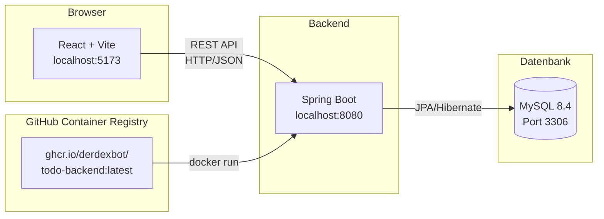
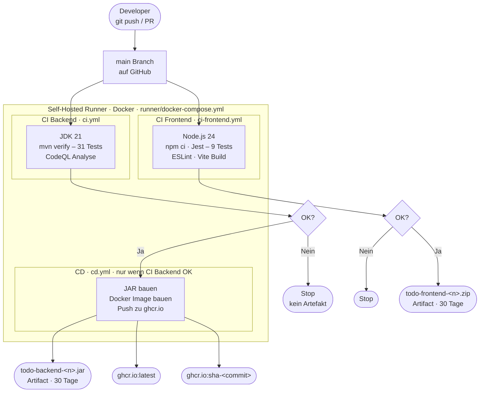
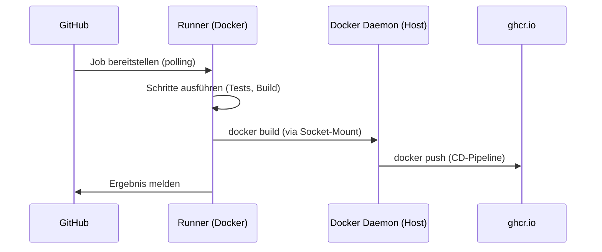
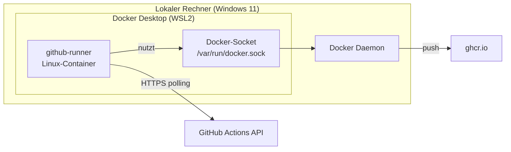

# Modul 324 DevOps – ToDo-Applikation

**Projekt:** M324 Schul-Projekt | **Team:** Rudy & Martin | **Stack:** React · Spring Boot · MySQL · Docker · GitHub Actions

---

## Inhalt

- [Architektur](#architektur)
- [CI/CD-Pipeline](#cicd-pipeline)
- [Self-Hosted Runner](#self-hosted-runner)
- [Lokale Entwicklung](#lokale-entwicklung)
- [Tests ausführen](#tests-ausführen)
- [Dokumentation](#dokumentation)

---

## Architektur



---

## CI/CD-Pipeline

Jeder Push und Pull Request auf `main` löst automatisch die Pipelines aus.



> **Alle Pipelines laufen auf dem lokalen Self-Hosted Runner** – kein GitHub-Minutenkontingent verbraucht.

---

## Self-Hosted Runner

Die GitHub-Actions-Jobs werden nicht auf GitHub-VMs, sondern auf einem **lokalen Docker-Container** ausgeführt. Der Runner verbindet sich via HTTPS zu GitHub und holt Jobs ab – kein eingehender Port nötig.



### Runner starten

**1. PAT erstellen**

GitHub → Settings → Developer Settings → Personal Access Tokens → Tokens (classic)
- Scope: **`repo`** (vollständig)

**2. `.env`-Datei anlegen**

```bash
cd runner
cp .env.example .env
```

```env
REPO_URL=https://github.com/DerDexBot/Modul_324_DevOps
ACCESS_TOKEN=ghp_DEIN_TOKEN_HIER
RUNNER_NAME=local-docker-runner
RUNNER_LABELS=self-hosted,linux,x64
```

**3. Runner starten**

```bash
docker compose up -d
```

**4. Status prüfen**

GitHub → Repository → Settings → Actions → Runners → Runner erscheint als **Idle**



---

## Lokale Entwicklung

### Voraussetzungen

- Java 21
- Node.js 24
- Docker Desktop
- Maven

### Backend starten

```bash
cd backend
./mvnw spring-boot:run
# Läuft auf http://localhost:8080
```

> Für Persistenz: MySQL über Docker Compose starten (siehe `backend/`).

### Frontend starten

```bash
cd frontend
npm install
npm run dev
# Läuft auf http://localhost:5173
```

---

## Tests ausführen

### Backend (31 Tests)

```bash
cd backend
./mvnw verify
```

| Schicht | Testklasse | Tests |
|---|---|---|
| Repository | `TaskRepositoryTest` | 9 |
| Service | `TaskServiceTest` | 10 |
| Controller | `TaskControllerTest` | 11 |
| Kontext | `DemoApplicationTests` | 1 |

### Frontend (9 Tests)

```bash
cd frontend
npm test -- --watchAll=false
```

| Kategorie | Tests |
|---|---|
| Grundfunktionen (Laden, Erstellen, Validierung) | 3 |
| US-20: Filter (Alle / Offen / Erledigt) | 3 |
| US-21: Fortschrittsbalken | 3 |

---

## Dokumentation

Alle Docs liegen unter `backend/docs/`:

| Thema | Pfad |
|---|---|
| CI Frontend | `docs/CI/ci-frontend-dokumentation.md` |
| Self-Hosted Runner | `docs/CI/runner-dokumentation.md` |
| CD / Docker | `docs/CD/cd-dokumentation.md` |
| Testplan | `docs/Testing/testplan.md` |
| Testdurchführung | `docs/Testing/testdurchfuehrung.md` |
| Testprotokolle | `docs/Testing/testprotokoll.md` |
| Branching-Strategie | `docs/Branching-Strategie/branching-strategie.md` |
| Pull Requests | `docs/Pull-Requests/pull-requests.md` |
| User Stories | `docs/userStories/userStories.md` |
| Arbeitsjournale | `docs/Arbeitsjournale/` |
