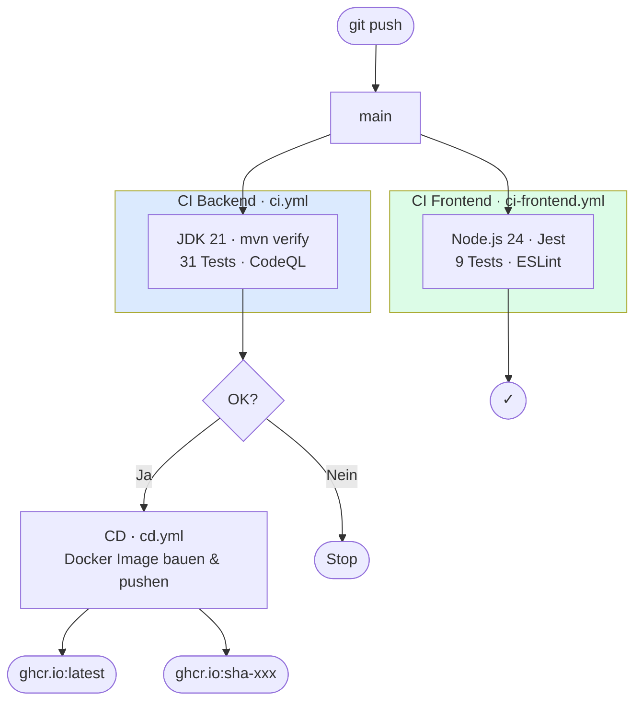
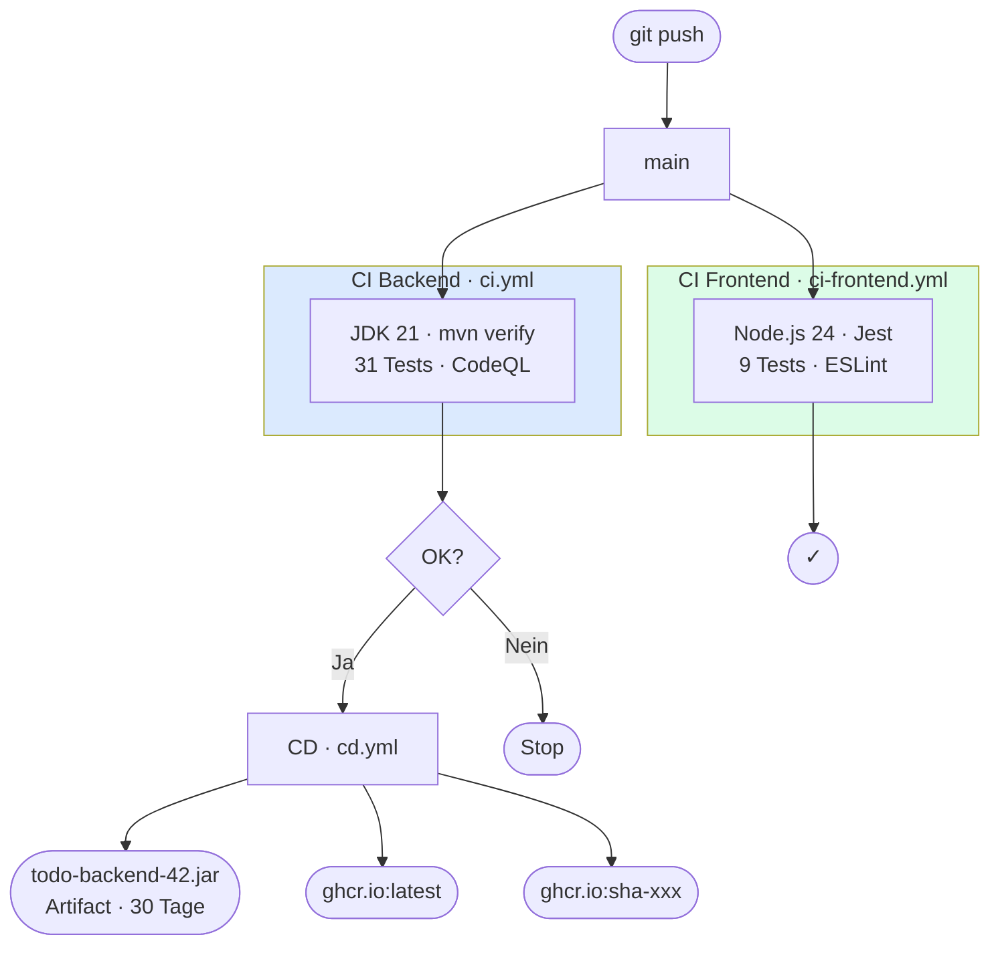
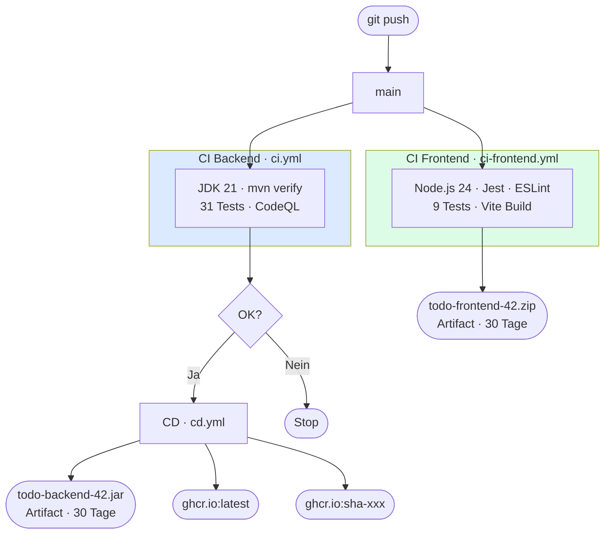

# Arbeitsjournal – 12.06.2026

**Projekt:** Modul 324 DevOps – ToDo-Applikation  
**Dauer:** ca. 3 Stunden  
**Beteiligte:** Rudy, Martin

---

## Ziele der Sitzung

1. CI-Pipeline für Frontend-Tests (Jest/Node.js) erstellen
2. Dokumentation des Frontend-CI-Vorgehens
3. Bestehende Docs-Diagramme auf Mermaid-Syntax umstellen
4. Self-Hosted GitHub Actions Runner mit Docker einrichten
5. README komplett überarbeiten mit Mermaid-Diagrammen

---

## Durchgeführte Arbeiten

### 1. Frontend-CI-Workflow (`ci-frontend.yml`)

**Problem:** Bisher gab es nur einen CI-Workflow für das Backend (Maven/JUnit). Die 9 Frontend-Tests (Jest) wurden nur lokal ausgeführt, aber nicht automatisch bei jedem Push geprüft.

**Lösung:** Neuer GitHub Actions Workflow `.github/workflows/ci-frontend.yml`:

```yaml
name: CI Frontend
on:
  push:
    branches: [ main ]
  pull_request:
    branches: [ main ]
jobs:
  test:
    runs-on: ubuntu-latest
    steps:
      - uses: actions/checkout@v4
      - uses: actions/setup-node@v4
        with:
          node-version: '20'
          cache: 'npm'
          cache-dependency-path: frontend/package-lock.json
      - run: npm ci
        working-directory: frontend
      - run: npm test -- --watchAll=false
        working-directory: frontend
      - run: npm run lint
        working-directory: frontend
```

**Wichtige Entscheidungen:**
- `npm ci` statt `npm install` für reproduzierbare Builds aus der `package-lock.json`
- `--watchAll=false` verhindert, dass Jest im Watch-Modus blockiert
- `setup-node@v4` mit `cache: 'npm'` beschleunigt den Workflow durch Caching
- Node.js 20 LTS als stabile Basis
- ESLint als Qualitätssicherung (entspricht CodeQL beim Backend)

**Lernerkenntnisse:**
- Der `CI=true`-Flag wird in GitHub Actions automatisch gesetzt – Jest würde auch ohne `--watchAll=false` einmalig laufen. Der Flag macht es aber explizit und verständlicher
- `npm ci` ist deutlich schneller als `npm install` in CI, weil es kein Dependency-Solving macht
- Der npm-Cache wird am Commit-Hash der `package-lock.json` festgemacht – ändert sich die Datei, wird der Cache invalidiert

---

### 2. Dokumentation: `backend/docs/CI/ci-frontend-dokumentation.md`

Neue Dokumentationsdatei erstellt, die erklärt:
- Warum ein separater CI für das Frontend
- Schritt-für-Schritt-Erklärung aller Workflow-Schritte
- Vergleich Backend-CI vs. Frontend-CI (Tabelle)
- Wie man die Tests lokal ausführt
- Fehlerbehebungstabelle

---

### 3. Mermaid-Diagramme in bestehenden Docs

**Problem:** Bestehende Dokumentationen nutzten ASCII-Art für Diagramme. Diese sind schwer lesbar und nicht skalierbar.

**Lösung:** ASCII-Diagramme durch Mermaid ersetzt – Mermaid wird von GitHub nativ gerendert.

#### `backend/docs/CD/cd-dokumentation.md`
- ASCII CI/CD-Flussdiagramm → `flowchart TD` mit allen drei Pipelines (CI Backend, CI Frontend, CD)
- Zeigt deutlich, dass CI Backend und CI Frontend **parallel** laufen
- CD hängt nur von CI Backend ab (da nur Backend als Docker-Image ausgeliefert wird)

#### `backend/docs/Testing/testplan.md`
- ASCII-Testpyramide → `flowchart TD` mit Subgraphen pro Schicht
- Jeder Block zeigt Testklasse, Anzahl Tests, Annotation und Zweck
- Pfeilrichtung zeigt die Hierarchie (Repository → Service → Controller)

#### `backend/docs/Branching-Strategie/branching-strategie.md`
- Neues `flowchart LR` für den GitHub-Flow-Ablauf (Branch → Review → Merge)
- Neues `gitGraph` zeigt den tatsächlichen Branch-Verlauf im Repo
- Beide Diagramme ergänzen die bestehende Textbeschreibung

---

### 4. Self-Hosted GitHub Actions Runner (`runner/`)

**Problem:** GitHub-hosted Runner haben ein Zeitlimit (2000 Min/Monat kostenlos) und keinen Zugriff auf lokale Ressourcen. Für das Schulprojekt wollen wir die Pipelines auf dem eigenen Rechner ausführen.

**Lösung:** Neuer Ordner `runner/` mit Docker Compose Setup:

```
runner/
├── docker-compose.yml    ← myoung34/github-runner Image
├── .env.example          ← Vorlage (REPO_URL, ACCESS_TOKEN, Labels)
└── .gitignore            ← schützt .env vor versehentlichem Commit
```

**Funktionsweise:**
- Der Container `myoung34/github-runner` registriert sich automatisch via PAT bei GitHub
- Er pollt die GitHub Actions API und holt Jobs ab, sobald ein Push auf `main` erfolgt
- Der Docker-Socket-Mount (`/var/run/docker.sock`) gibt dem Runner Zugriff auf den Host-Docker-Daemon – nötig für den CD-Workflow (`docker build`, `docker push`)
- Bei Container-Neustart re-registriert sich der Runner automatisch (dank `ACCESS_TOKEN` statt Einmal-Token)

**Alle Workflows umgestellt:**

```yaml
# Vorher
runs-on: ubuntu-latest

# Nachher
runs-on: [self-hosted, linux, x64]
```

**Lernerkenntnisse:**
- `ACCESS_TOKEN` (PAT) ist besser als `RUNNER_TOKEN` (Einmal-Token, 1h gültig), weil der Container nach Neustart selbständig re-registriert
- Docker-Socket-Mount = Docker-outside-of-Docker (DooD): der Container nutzt den Docker-Daemon des Hosts, ohne eigenen Daemon zu starten
- `no-new-privileges: true` in den Security-Optionen verhindert Privilege-Escalation im Container
- Self-Hosted Runner dürfen **nicht** für öffentliche Fork-PRs verwendet werden (Sicherheitsrisiko)

---

### 5. README komplett überarbeitet

**Problem:** Die ursprüngliche README war ein unverändertes Schulvorlage-Template ohne Projektbezug.

**Lösung:** Vollständige Neufassung mit fünf Abschnitten und vier Mermaid-Diagrammen:

| Diagramm | Typ | Inhalt |
|---|---|---|
| Architektur | `flowchart LR` | Frontend → Backend → MySQL → ghcr.io |
| CI/CD-Pipeline | `flowchart TD` | Alle 3 Workflows mit Abhängigkeiten |
| Runner-Sequenz | `sequenceDiagram` | Ablauf GitHub ↔ Runner ↔ Docker ↔ ghcr.io |
| Runner-Infrastruktur | `flowchart LR` | Docker Desktop, Socket-Mount, lokaler Daemon |

---

## Ergebnisse

| Komponente | Status |
|---|---|
| `.github/workflows/ci-frontend.yml` | Erstellt ✓ |
| `backend/docs/CI/ci-frontend-dokumentation.md` | Erstellt ✓ |
| CD-Docs: Mermaid-Diagramm | Aktualisiert ✓ |
| Testing-Docs: Mermaid-Pyramide | Aktualisiert ✓ |
| Branching-Docs: Mermaid-Diagramme | Aktualisiert ✓ |
| `runner/docker-compose.yml` | Erstellt ✓ |
| `runner/.env.example` | Erstellt ✓ |
| `backend/docs/CI/runner-dokumentation.md` | Erstellt ✓ |
| Alle Workflows auf `self-hosted` umgestellt | Aktualisiert ✓ |
| `README.md` vollständig überarbeitet | Aktualisiert ✓ |

---

## Pipeline-Gesamtbild nach dieser Sitzung



> Alle Jobs laufen auf dem **lokalen Self-Hosted Runner** (`runner/docker-compose.yml`).

---

### 6. CD: JAR als downloadbares GitHub-Artefakt

**Problem:** Nach einem erfolgreichen CD-Lauf war das Backend nur als Docker-Image in ghcr.io verfügbar – also nur für Nutzer mit Docker erreichbar. Ein direkter JAR-Download war nicht möglich.

**Lösung:** `actions/upload-artifact@v4` nach dem JAR-Build in `cd.yml` eingefügt:

```yaml
- name: Upload JAR artifact
  uses: actions/upload-artifact@v4
  with:
    name: todo-backend-${{ github.run_number }}
    path: backend/target/*.jar
    retention-days: 30
```

**Download:** GitHub → Actions → CD-Lauf → **Artifacts** → `todo-backend-<run_number>.jar`

**Lernerkenntnisse:**
- `github.run_number` ist eine fortlaufende Ganzzahl (1, 2, 3 ...) und macht jeden Build eindeutig identifizierbar
- `retention-days: 30` hält das Artefakt 30 Tage verfügbar – danach wird es automatisch gelöscht (für ein Schulprojekt ausreichend)
- `upload-artifact` braucht keine zusätzlichen Permissions – der Standard-Workflow-Token reicht
- Das Docker-Image in ghcr.io bleibt unverändert daneben bestehen; beide Ausgaben ergänzen sich

---

## Ergebnisse

| Komponente | Status |
|---|---|
| `.github/workflows/ci-frontend.yml` | Erstellt ✓ |
| `backend/docs/CI/ci-frontend-dokumentation.md` | Erstellt ✓ |
| CD-Docs: Mermaid-Diagramm | Aktualisiert ✓ |
| Testing-Docs: Mermaid-Pyramide | Aktualisiert ✓ |
| Branching-Docs: Mermaid-Diagramme | Aktualisiert ✓ |
| `runner/docker-compose.yml` | Erstellt ✓ |
| `runner/.env.example` | Erstellt ✓ |
| `backend/docs/CI/runner-dokumentation.md` | Erstellt ✓ |
| Alle Workflows auf `self-hosted` umgestellt | Aktualisiert ✓ |
| `README.md` vollständig überarbeitet | Aktualisiert ✓ |
| CD: JAR-Artefakt Upload | Aktualisiert ✓ |

---

## Pipeline-Gesamtbild nach dieser Sitzung



> Alle Jobs laufen auf dem **lokalen Self-Hosted Runner** (`runner/docker-compose.yml`).

---

### 7. CI Frontend: Vite-Build + Artifact

**Problem:** Die Frontend-Pipeline prüfte Tests und Lint, baute die App aber nie. Ein Fehler im Produktions-Build (z.B. fehlender Import) wäre unentdeckt geblieben. Ausserdem gab es kein downloadbares Frontend-Artefakt.

**Lösung:** Zwei neue Schritte am Ende von `ci-frontend.yml`:

```yaml
- name: Build production bundle
  working-directory: frontend
  run: npm run build

- name: Upload dist artifact
  uses: actions/upload-artifact@v4
  with:
    name: todo-frontend-${{ github.run_number }}
    path: frontend/dist/
    retention-days: 30
```

**Download:** GitHub → Actions → CI Frontend-Lauf → **Artifacts** → `todo-frontend-<run_number>.zip`

Das ZIP enthält den fertigen Produktions-Build (`index.html`, gebündelte JS/CSS-Assets) – direkt deploybar auf jedem statischen Webserver.

**Lernerkenntnisse:**
- `npm run build` = Vite bündelt alle Module, minifiziert CSS/JS und legt alles in `frontend/dist/` ab
- Der Build-Schritt steht **nach** Tests und Lint: Schlägt ein Test fehl, wird gar nicht erst gebaut
- Tests können grün sein, während der Build scheitert (z.B. ungültige JSX-Syntax in einer nicht getesteten Datei) – daher ist der Build-Schritt eine sinnvolle Ergänzung
- GitHub Actions zipt `dist/` automatisch beim Upload → Download als ZIP

---

## Ergebnisse

| Komponente | Status |
|---|---|
| `.github/workflows/ci-frontend.yml` | Erstellt ✓ |
| `backend/docs/CI/ci-frontend-dokumentation.md` | Erstellt ✓ |
| CD-Docs: Mermaid-Diagramm | Aktualisiert ✓ |
| Testing-Docs: Mermaid-Pyramide | Aktualisiert ✓ |
| Branching-Docs: Mermaid-Diagramme | Aktualisiert ✓ |
| `runner/docker-compose.yml` | Erstellt ✓ |
| `runner/.env.example` | Erstellt ✓ |
| `backend/docs/CI/runner-dokumentation.md` | Erstellt ✓ |
| Alle Workflows auf `self-hosted` umgestellt | Aktualisiert ✓ |
| `README.md` vollständig überarbeitet | Aktualisiert ✓ |
| CD: JAR-Artefakt Upload | Aktualisiert ✓ |
| CI Frontend: Vite-Build + dist/-Artefakt | Aktualisiert ✓ |

---

## Pipeline-Gesamtbild nach dieser Sitzung



> Alle Jobs laufen auf dem **lokalen Self-Hosted Runner** (`runner/docker-compose.yml`).

---

## Offene Punkte / Nächste Schritte

- CD könnte optional auch auf erfolgreichen Frontend-CI warten (`needs`-Abhängigkeit)
- Runner-PAT regelmässig rotieren (Ablaufdatum setzen)
