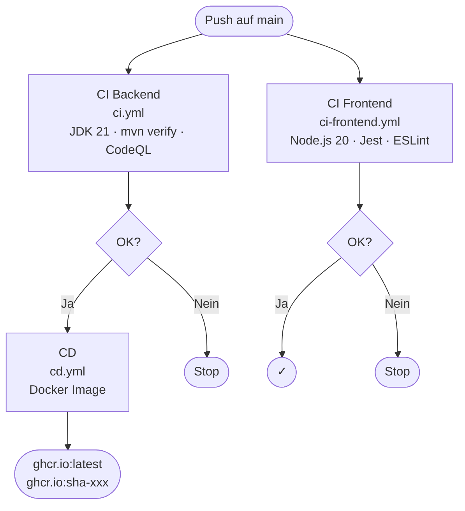

# Arbeitsjournal – 12.06.2026

**Projekt:** Modul 324 DevOps – ToDo-Applikation  
**Dauer:** ca. 2 Stunden  
**Beteiligte:** Rudy, Martin

---

## Ziele der Sitzung

1. CI-Pipeline für Frontend-Tests (Jest/Node.js) erstellen
2. Dokumentation des Frontend-CI-Vorgehens
3. Bestehende Docs-Diagramme auf Mermaid-Syntax umstellen

---

## Durchgeführte Arbeiten

### 1. Frontend-CI-Workflow (`ci-frontend.yml`)

**Problem:** Bisher gab es nur einen CI-Workflow für das Backend (Maven/JUnit). Die 9 Frontend-Tests (Jest) wurden nur lokal ausgeführt, aber nicht automatisch bei jedem Push geprüft.

**Lösung:** Neuer GitHub Actions Workflow `.github/workflows/ci-frontend.yml`:

```yaml
name: CI Frontend
on:
  push:
    branches: [ main ]
  pull_request:
    branches: [ main ]
jobs:
  test:
    runs-on: ubuntu-latest
    steps:
      - uses: actions/checkout@v4
      - uses: actions/setup-node@v4
        with:
          node-version: '20'
          cache: 'npm'
          cache-dependency-path: frontend/package-lock.json
      - run: npm ci
        working-directory: frontend
      - run: npm test -- --watchAll=false
        working-directory: frontend
      - run: npm run lint
        working-directory: frontend
```

**Wichtige Entscheidungen:**
- `npm ci` statt `npm install` für reproduzierbare Builds aus der `package-lock.json`
- `--watchAll=false` verhindert, dass Jest im Watch-Modus blockiert
- `setup-node@v4` mit `cache: 'npm'` beschleunigt den Workflow durch Caching
- Node.js 20 LTS als stabile Basis
- ESLint als Qualitätssicherung (entspricht CodeQL beim Backend)

**Lernerkenntnisse:**
- Der `CI=true`-Flag wird in GitHub Actions automatisch gesetzt – Jest würde auch ohne `--watchAll=false` einmalig laufen. Der Flag macht es aber explizit und verständlicher
- `npm ci` ist deutlich schneller als `npm install` in CI, weil es kein Dependency-Solving macht
- Der npm-Cache wird am Commit-Hash der `package-lock.json` festgemacht – ändert sich die Datei, wird der Cache invalidiert

---

### 2. Dokumentation: `backend/docs/CI/ci-frontend-dokumentation.md`

Neue Dokumentationsdatei erstellt, die erklärt:
- Warum ein separater CI für das Frontend
- Schritt-für-Schritt-Erklärung aller Workflow-Schritte
- Vergleich Backend-CI vs. Frontend-CI (Tabelle)
- Wie man die Tests lokal ausführt
- Fehlerbehebungstabelle

---

### 3. Mermaid-Diagramme in bestehenden Docs

**Problem:** Bestehende Dokumentationen nutzten ASCII-Art für Diagramme. Diese sind schwer lesbar und nicht skalierbar.

**Lösung:** ASCII-Diagramme durch Mermaid ersetzt – Mermaid wird von GitHub nativ gerendert.

#### `backend/docs/CD/cd-dokumentation.md`
- ASCII CI/CD-Flussdiagramm → `flowchart TD` mit allen drei Pipelines (CI Backend, CI Frontend, CD)
- Zeigt deutlich, dass CI Backend und CI Frontend **parallel** laufen
- CD hängt nur von CI Backend ab (da nur Backend als Docker-Image ausgeliefert wird)

#### `backend/docs/Testing/testplan.md`
- ASCII-Testpyramide → `flowchart TD` mit Subgraphen pro Schicht
- Jeder Block zeigt Testklasse, Anzahl Tests, Annotation und Zweck
- Pfeilrichtung zeigt die Hierarchie (Repository → Service → Controller)

#### `backend/docs/Branching-Strategie/branching-strategie.md`
- Neues `flowchart LR` für den GitHub-Flow-Ablauf (Branch → Review → Merge)
- Neues `gitGraph` zeigt den tatsächlichen Branch-Verlauf im Repo
- Beide Diagramme ergänzen die bestehende Textbeschreibung

---

## Ergebnisse

| Komponente | Status |
|---|---|
| `.github/workflows/ci-frontend.yml` | Erstellt ✓ |
| `backend/docs/CI/ci-frontend-dokumentation.md` | Erstellt ✓ |
| CD-Docs: Mermaid-Diagramm | Aktualisiert ✓ |
| Testing-Docs: Mermaid-Pyramide | Aktualisiert ✓ |
| Branching-Docs: Mermaid-Diagramme | Aktualisiert ✓ |

---

## Pipeline-Gesamtbild nach dieser Sitzung



---

## Offene Punkte / Nächste Schritte

- Frontend-CI könnte erweitert werden um einen Build-Schritt (`npm run build`), um sicherzustellen, dass der Produktions-Build erfolgreich ist
- Optionale Verbesserung: CD könnte auch auf erfolgreichen Frontend-CI warten (über `needs`-Abhängigkeit in GitHub Actions)
