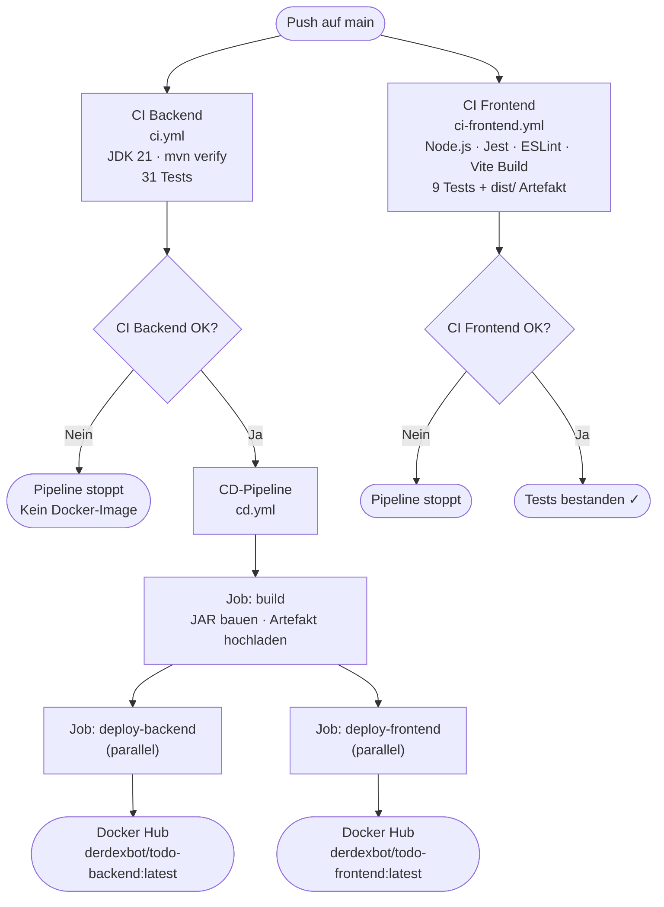
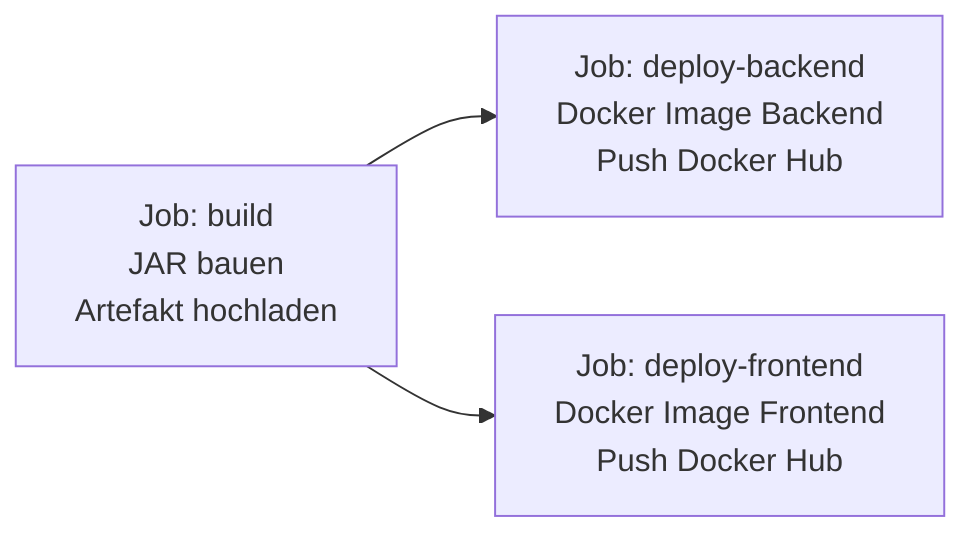

# CD-Dokumentation – ToDo-App

**Projekt:** Modul 324 DevOps – ToDo-Applikation  
**Komponente:** Backend & Frontend (Spring Boot + React)  
**Datum:** 19.06.2026  
**Autoren:** Rudy, Martin

---

## 1. Was ist CD?

**Continuous Delivery / Continuous Deployment (CD)** ist die Erweiterung von CI um den automatischen Auslieferungsschritt.

| Begriff | Bedeutung |
|---|---|
| **CI** (Continuous Integration) | Code wird automatisch gebaut und getestet |
| **CD** (Continuous Delivery) | Getesteter Code wird automatisch als auslieferbares Artefakt verpackt |
| **CD** (Continuous Deployment) | Artefakt wird zusätzlich automatisch auf einen Server deployed |

In diesem Projekt wird **Continuous Delivery** umgesetzt: Nach jedem erfolgreichen CI-Lauf auf `main` werden Docker-Images für Backend und Frontend gebaut und auf Docker Hub veröffentlicht. Die Images sind damit jederzeit bereit, auf einem beliebigen Rechner mit `docker compose up` gestartet zu werden.

---

## 2. Übersicht: Gesamte CI/CD-Pipeline



**Ablauf:** CI Backend und CI Frontend laufen parallel. Die CD-Pipeline startet nur wenn CI Backend erfolgreich war. Innerhalb der CD laufen `deploy-backend` und `deploy-frontend` parallel nach dem `build`-Job.

---

## 3. Dockerfiles

### 3.1 Backend (`backend/Dockerfile`)

Das Backend-Dockerfile verwendet einen **Multi-Stage Build**: Maven baut den JAR im ersten Stage, der zweite Stage enthält nur das JRE und den fertigen JAR.

```dockerfile
FROM maven:3.9-eclipse-temurin-21-alpine AS build
WORKDIR /app
COPY pom.xml .
RUN mvn dependency:go-offline -q
COPY src ./src
RUN mvn package -DskipTests -B -q

FROM eclipse-temurin:21-jre-alpine
WORKDIR /app
COPY --from=build /app/target/*.jar app.jar
EXPOSE 8080
ENTRYPOINT ["java", "-jar", "app.jar"]
```

| Stage | Basis-Image | Aufgabe |
|---|---|---|
| `build` | `maven:3.9-eclipse-temurin-21-alpine` | Dependencies laden, JAR bauen |
| Final | `eclipse-temurin:21-jre-alpine` | Nur JAR ausführen |

**Warum Multi-Stage?** Das finale Image enthält nur das JRE und den JAR – kein Maven, kein JDK, keine Source-Dateien. Das reduziert die Image-Grösse und die Angriffsfläche erheblich.

**Warum `dependency:go-offline` zuerst?** Docker cached jeden Layer. Solange sich `pom.xml` nicht ändert, wird der Dependency-Download-Layer wiederverwendet. Nur bei Änderungen am Source-Code wird neu gebaut.

### 3.2 Frontend (`frontend/Dockerfile`)

Das Frontend-Dockerfile verwendet ebenfalls Multi-Stage: Node.js baut die React-App, nginx liefert die statischen Dateien aus.

```dockerfile
FROM node:20-alpine AS build
WORKDIR /app
COPY package*.json ./
RUN npm install
COPY . .
RUN npm run build

FROM nginx:alpine
COPY --from=build /app/dist /usr/share/nginx/html
EXPOSE 80
```

| Stage | Basis-Image | Aufgabe |
|---|---|---|
| `build` | `node:20-alpine` | npm install, Vite-Build → `dist/` |
| Final | `nginx:alpine` | Statische Dateien ausliefern |

**Warum nginx?** Die React-App ist nach dem Build eine Sammlung von HTML/CSS/JS-Dateien. nginx ist ein hochperformanter, schlanker Webserver der genau für diesen Zweck optimiert ist.

---

## 4. CD-Pipeline im Detail (`cd.yml`)

### Trigger

```yaml
on:
  workflow_run:
    workflows: ["CI"]
    types: [completed]
    branches: [main]
```

Die CD-Pipeline wird durch den Abschluss der CI Backend-Pipeline ausgelöst. Sie läuft nur wenn CI auf `main` erfolgreich abgeschlossen hat.

### Job-Struktur



### Job 1: `build`

| Schritt | Beschreibung |
|---|---|
| `actions/checkout@v4` | Code auschecken |
| `actions/setup-java@v4` | JDK 21 einrichten (mit Maven-Cache) |
| `mvn package -DskipTests -B` | JAR bauen (Tests liefen bereits in CI) |
| `actions/upload-artifact@v4` | JAR 30 Tage als Workflow-Artefakt verfügbar |

### Job 2: `deploy-backend`

| Schritt | Beschreibung |
|---|---|
| `actions/checkout@v4` | Code auschecken |
| `docker/login-action@v3` | Login bei Docker Hub mit Secrets |
| `docker/metadata-action@v5` | Tags generieren (`latest` + `sha-<commit>`) |
| `docker/build-push-action@v5` | Multi-Stage Build + Push zu Docker Hub |

### Job 3: `deploy-frontend`

Identischer Ablauf wie `deploy-backend`, jedoch mit `context: ./frontend` und Image-Name `todo-frontend`.

### Secrets

| Secret | Wert | Verwendung |
|---|---|---|
| `DOCKERHUB_USERNAME` | Docker Hub Benutzername | Image-Name + Login |
| `DOCKERHUB_TOKEN` | Docker Hub Access Token | Login-Authentifizierung |

Die Secrets werden in **GitHub → Repository → Settings → Secrets and variables → Actions** hinterlegt.

---

## 5. Artefakte

### JAR-Artefakt (GitHub Actions)

Nach jedem CD-Lauf ist das JAR 30 Tage unter **GitHub → Actions → CD-Lauf → Artifacts** downloadbar.

Der Name enthält die Laufnummer (`todo-backend-<run_number>`), sodass jeder Build eindeutig identifizierbar ist.

### Docker-Image Tags

Pro Deployment werden zwei Tags erstellt:

| Tag | Beispiel | Verwendung |
|---|---|---|
| `latest` | `derdexbot/todo-backend:latest` | Immer das aktuellste Image auf `main` |
| `sha-<commit>` | `derdexbot/todo-backend:sha-1f3e249` | Eindeutige Version pro Commit, ermöglicht Rollback |

Dies gilt für Backend und Frontend gleichermassen.

---

## 6. Images auf Docker Hub

Nach erfolgreicher Pipeline sind beide Images öffentlich verfügbar:

```
hub.docker.com/r/derdexbot/todo-backend
hub.docker.com/r/derdexbot/todo-frontend
```

---

## 7. Lokales Testen mit Docker Compose

Siehe [Docker-Compose-Dokumentation](../Docker/docker-dokumentation.md) für die vollständige Anleitung.

Kurzform:
```bash
# .env im Root-Verzeichnis erstellen
echo "DOCKERHUB_USERNAME=derdexbot" > .env

# App starten (Images werden automatisch von Docker Hub gezogen)
docker compose up
```

Danach erreichbar unter `http://localhost:3000` (Frontend) und `http://localhost:8080` (Backend).

---

## 8. Abgrenzung zu Continuous Deployment

In diesem Projekt endet die Pipeline beim **Veröffentlichen der Images** (Continuous Delivery). Die Images werden nicht automatisch auf einen produktiven Server deployed.

In einem professionellen Umfeld würde ein weiterer Schritt folgen (z.B. Kubernetes, eine VM oder ein Cloud-Dienst). Für das Schulprojekt ist Continuous Delivery ausreichend, da es das Kernkonzept – automatisiertes, reproduzierbares Bauen und Verpacken – vollständig abdeckt.
