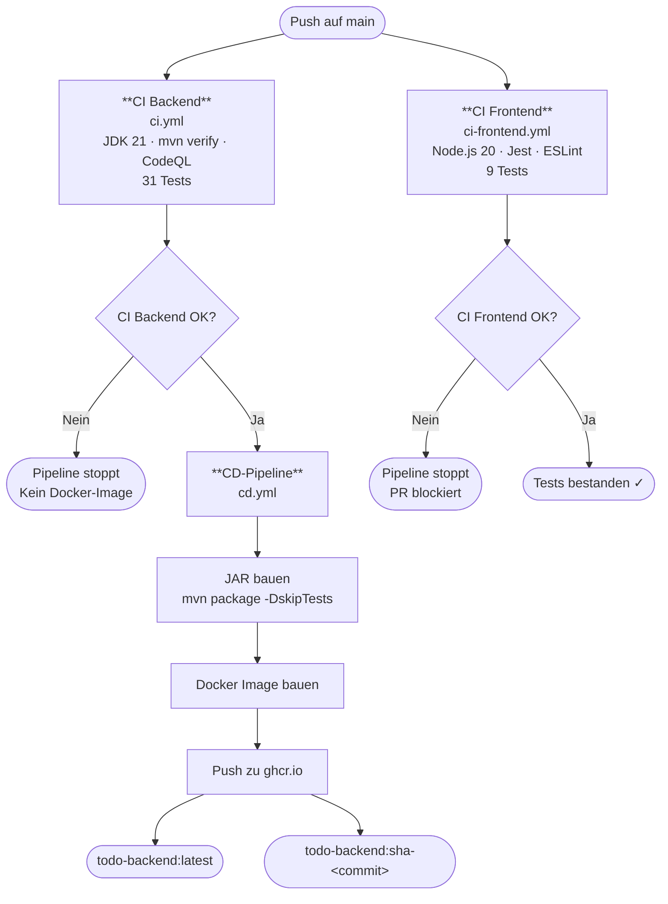
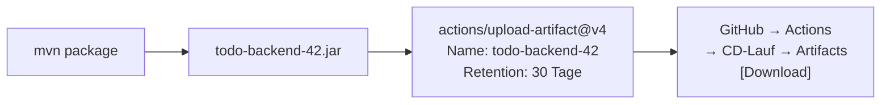

# CD-Dokumentation – Backend ToDo-App

**Projekt:** Modul 324 DevOps – ToDo-Applikation  
**Komponente:** Backend (Spring Boot)  
**Datum:** 05.06.2026  
**Autoren:** Rudy, Martin

---

## 1. Was ist CD?

**Continuous Delivery / Continuous Deployment (CD)** ist die Erweiterung von CI um den automatischen Auslieferungsschritt.

| Begriff | Bedeutung |
|---|---|
| **CI** (Continuous Integration) | Code wird automatisch gebaut und getestet |
| **CD** (Continuous Delivery) | Getesteter Code wird automatisch als auslieferbares Artefakt verpackt |
| **CD** (Continuous Deployment) | Artefakt wird zusätzlich automatisch auf einen Server deployed |

In diesem Projekt wird **Continuous Delivery** umgesetzt: Nach jedem erfolgreichen CI-Lauf auf `main` wird ein Docker-Image gebaut und in der GitHub Container Registry veröffentlicht. Das Image ist damit jederzeit bereit, auf einem beliebigen Server gestartet zu werden.

---

## 2. Übersicht: CI/CD-Pipeline



**Wichtig:** Die CD-Pipeline startet **nur**, wenn die CI Backend-Pipeline erfolgreich durchgelaufen ist. Schlagen Tests fehl, wird kein Image gebaut. CI Backend und CI Frontend laufen **parallel** – die CD hängt nur vom Backend-CI ab, da nur das Backend als Docker-Image ausgeliefert wird.

---

## 3. Dockerfile

Das Dockerfile liegt unter `backend/Dockerfile` und beschreibt, wie das Spring-Boot-Backend als Container verpackt wird.

```dockerfile
FROM eclipse-temurin:21-jre-alpine
WORKDIR /app
COPY target/*.jar app.jar
EXPOSE 8080
ENTRYPOINT ["java", "-jar", "app.jar"]
```

### Erklärung Zeile für Zeile

| Zeile | Bedeutung |
|---|---|
| `FROM eclipse-temurin:21-jre-alpine` | Basis-Image: Java 21 JRE auf Alpine Linux (klein, sicher) |
| `WORKDIR /app` | Arbeitsverzeichnis im Container |
| `COPY target/*.jar app.jar` | Das von Maven gebaute JAR wird ins Image kopiert |
| `EXPOSE 8080` | Dokumentiert, dass der Container Port 8080 nutzt |
| `ENTRYPOINT [...]` | Startet das JAR beim Containerstart |

**Warum `jre` statt `jdk`?** Im Container muss die Anwendung nur laufen, nicht kompiliert werden. Das JRE-Image ist deshalb kleiner und hat eine kleinere Angriffsfläche.

**Warum `alpine`?** Alpine Linux ist eine minimale Linux-Distribution (~5 MB), was das finale Image deutlich kleiner macht als z.B. Ubuntu.

---

## 4. CD-Pipeline im Detail (`cd.yml`)

### Trigger

```yaml
on:
  workflow_run:
    workflows: ["CI"]
    types: [completed]
    branches: [main]
```

Die CD-Pipeline wird durch den Abschluss der CI-Pipeline ausgelöst (`workflow_run`). Sie läuft nur, wenn CI auf dem Branch `main` abgeschlossen wurde.

### Bedingung

```yaml
if: ${{ github.event.workflow_run.conclusion == 'success' }}
```

Nur wenn CI mit `success` abgeschlossen hat, wird der Job ausgeführt. Bei fehlgeschlagenen Tests bricht die Pipeline hier ab.

### Schritte

| Schritt | Beschreibung |
|---|---|
| `actions/checkout@v4` | Code auschecken |
| `actions/setup-java@v4` | JDK 21 einrichten (mit Maven-Cache) |
| `mvn package -DskipTests` | JAR bauen (Tests wurden bereits in CI ausgeführt) |
| `actions/upload-artifact@v4` | JAR als Workflow-Artefakt hochladen (30 Tage downloadbar) |
| `docker/login-action@v3` | Login bei GitHub Container Registry mit `GITHUB_TOKEN` |
| `docker/metadata-action@v5` | Image-Tags automatisch generieren (`latest` + Commit-SHA) |
| `docker/build-push-action@v5` | Docker-Image bauen und in ghcr.io pushen |

### Berechtigungen

```yaml
permissions:
  contents: read
  packages: write
```

`packages: write` erlaubt das Pushen von Images in die GitHub Container Registry. Der `GITHUB_TOKEN` ist automatisch in GitHub Actions verfügbar – kein manuelles Secret nötig.

---

## 5. Artefakte

### JAR-Artefakt (GitHub Actions)

Nach jedem erfolgreichen CD-Lauf wird das JAR automatisch als Workflow-Artefakt hochgeladen:



**Download:** GitHub → Actions → CD-Lauf auswählen → Abschnitt **Artifacts** → `todo-backend-<run_number>.jar`

Die Nummer im Namen entspricht der fortlaufenden Laufnummer des Workflows (`github.run_number`), sodass jeder Build eindeutig identifizierbar bleibt.

### Docker-Image Tags

Pro Deployment werden zwei Tags erstellt:

| Tag | Beispiel | Verwendung |
|---|---|---|
| `latest` | `ghcr.io/derdexbot/todo-backend:latest` | Immer das aktuellste Image auf `main` |
| `sha-<commit>` | `ghcr.io/derdexbot/todo-backend:sha-ed662a0` | Eindeutige Version pro Commit, ermöglicht Rollback |

---

## 6. Image lokal verwenden

Das veröffentlichte Image kann auf jedem Rechner mit Docker gestartet werden:

```bash
# Image herunterladen und starten
docker run -p 8080:8080 \
  -e SPRING_DATASOURCE_URL=jdbc:mysql://host.docker.internal:3306/tododb \
  -e SPRING_DATASOURCE_USERNAME=todo \
  -e SPRING_DATASOURCE_PASSWORD=todo \
  ghcr.io/derdexbot/todo-backend:latest
```

Alternativ mit Docker Compose zusammen mit MySQL (bestehende `docker-compose.yaml` erweitern):

```yaml
services:
  backend:
    image: ghcr.io/derdexbot/todo-backend:latest
    ports:
      - "8080:8080"
    environment:
      SPRING_DATASOURCE_URL: jdbc:mysql://mysql:3306/tododb
      SPRING_DATASOURCE_USERNAME: todo
      SPRING_DATASOURCE_PASSWORD: todo
    depends_on:
      - mysql
  mysql:
    image: mysql:8.4
    # ... (bestehende Konfiguration)
```

---

## 7. Image auf GitHub einsehen

Nach jedem erfolgreichen CD-Lauf ist das Image sichtbar unter:

**GitHub → Repository → Packages** (rechte Seite)

Dort sind alle verfügbaren Tags und der Zeitstempel des letzten Builds aufgeführt.

---

## 8. Abgrenzung zu Continuous Deployment

In diesem Projekt endet die Pipeline beim **Veröffentlichen des Images** (Continuous Delivery). Das Image wird nicht automatisch auf einen produktiven Server deployed.

In einem professionellen Umfeld würde ein weiterer Schritt folgen (z.B. Deployment auf Kubernetes, einer VM oder einem Cloud-Dienst). Für das Schulprojekt ist Continuous Delivery ausreichend, da es das Kernkonzept – automatisiertes, reproduzierbares Bauen und Verpacken – vollständig abdeckt.