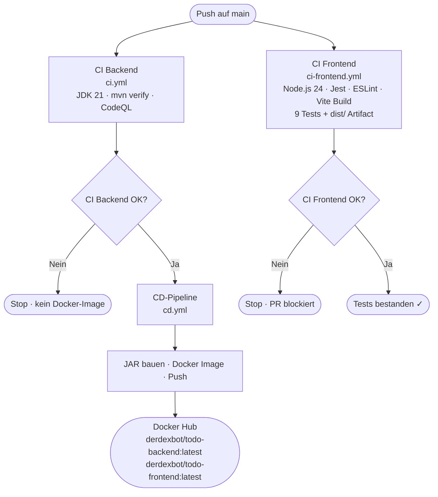
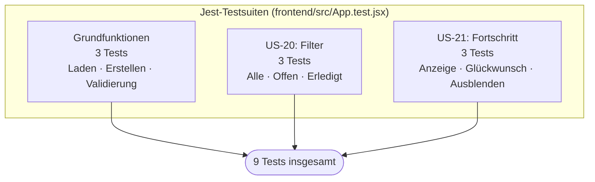
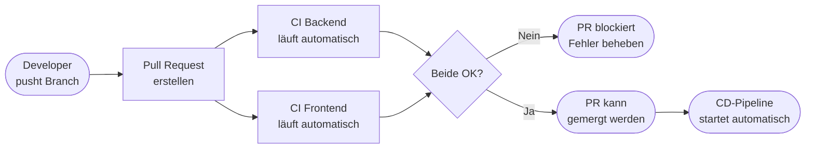

# CI-Dokumentation – Frontend ToDo-App

**Projekt:** Modul 324 DevOps – ToDo-Applikation  
**Komponente:** Frontend (React + Vite)  
**Datum:** 12.06.2026  
**Autoren:** Rudy, Martin

---

## 1. Was ist der Frontend-CI-Workflow?

Der Frontend-CI-Workflow automatisiert die Qualitätsprüfung des React-Frontends bei jedem Push und Pull Request auf `main`. Er stellt sicher, dass alle Jest-Tests bestehen und ESLint keine Fehler meldet – genau wie der Backend-CI, jedoch für die JavaScript/React-Komponenten.

---

## 2. Gesamtübersicht: Alle Pipelines



**Wichtig:** CI Backend und CI Frontend laufen **parallel und unabhängig** voneinander. Die CD-Pipeline hängt nur vom CI Backend ab (da nur das Backend als Docker-Image ausgeliefert wird).

---

## 3. Workflow-Konfiguration (`ci-frontend.yml`)

```yaml
name: CI Frontend

on:
  push:
    branches: [ main ]
  pull_request:
    branches: [ main ]

jobs:
  test:
    name: Frontend Tests (Jest)
    runs-on: ubuntu-latest

    steps:
      - uses: actions/checkout@v4

      - name: Set up Node.js 20
        uses: actions/setup-node@v4
        with:
          node-version: '20'
          cache: 'npm'
          cache-dependency-path: frontend/package-lock.json

      - name: Install dependencies
        working-directory: frontend
        run: npm install

      - name: Run Jest tests
        working-directory: frontend
        run: npm test -- --watchAll=false

      - name: ESLint analysis
        working-directory: frontend
        run: npm run lint
```

---

## 4. Schritt-für-Schritt-Erklärung

### Trigger

```yaml
on:
  push:
    branches: [ main ]
  pull_request:
    branches: [ main ]
```

Identisch zum Backend-CI: Der Workflow läuft bei jedem Push auf `main` und bei jedem Pull Request. So ist sichergestellt, dass keine fehlerhafte Änderung unbemerkt auf `main` landet.

### Schritte

| Schritt | Aktion | Erklärung |
|---|---|---|
| `actions/checkout@v4` | Code auschecken | Lädt den aktuellen Stand des Repos |
| `actions/setup-node@v4` | Node.js 24 einrichten | Installiert Node.js mit npm-Cache |
| `npm ci` | Abhängigkeiten installieren | Reproduzierbar aus `package-lock.json` |
| `npm test -- --watchAll=false` | Jest-Tests ausführen | Alle 9 Frontend-Tests |
| `npm run lint` | ESLint-Analyse | Statische Codeanalyse (entspricht CodeQL beim Backend) |
| `npm run build` | Produktions-Build | Vite bündelt und optimiert alle Assets nach `dist/` |
| `actions/upload-artifact@v4` | dist/ als Artefakt hochladen | 30 Tage downloadbar, nur bei bestandenen Tests |

### Warum `npm install` statt `npm ci`?

`npm ci` erfordert, dass `package.json` und `package-lock.json` exakt synchron sind. Da das Lock-File auf Windows generiert wird, fehlen Linux-spezifische optionale Pakete (z.B. `@emnapi/core`, `@emnapi/runtime`). Der Ubuntu-Runner erwartet diese Einträge und `npm ci` schlägt mit `EUSAGE` fehl.

`npm install` ist toleranter: es installiert alle Pakete korrekt und aktualisiert das Lock-File bei Bedarf, ohne den Build zu blockieren.

### Warum `--watchAll=false`?

Ohne diesen Flag würde Jest im Watch-Modus starten und auf Dateiänderungen warten – eine endlose Blockade in der CI-Umgebung. `--watchAll=false` stellt sicher, dass Jest alle Tests einmalig ausführt und danach beendet.

### Warum Node.js 24?

Node.js 24 ist die aktuelle Version und kompatibel mit allen verwendeten Abhängigkeiten (React 19, Vite 6, Jest 30).

### Warum `npm run build` im CI?

Der Vite-Produktions-Build prüft, ob alle Imports auflösbar sind und die App fehlerfrei kompiliert. Tests können bestehen, während der Build durch fehlende Abhängigkeiten oder Typfehler scheitert – der Build-Schritt schliesst diese Lücke. Das Ergebnis (`dist/`) wird direkt als Artefakt hochgeladen.

### npm-Cache

```yaml
cache: 'npm'
cache-dependency-path: frontend/package-lock.json
```

GitHub Actions cached automatisch den `node_modules`-Ordner basierend auf dem Hash der `package-lock.json`. Bei unveränderter Lock-Datei wird der Cache wiederverwendet, was den Workflow um mehrere Sekunden beschleunigt.

---

## 5. Vergleich: Backend-CI vs. Frontend-CI

| Aspekt | CI Backend | CI Frontend |
|---|---|---|
| **Datei** | `ci.yml` | `ci-frontend.yml` |
| **Laufzeitumgebung** | JDK 21 (Temurin) | Node.js 24 |
| **Build-Tool** | Maven (`mvn verify`) | npm (`npm ci`) |
| **Test-Framework** | JUnit 5 + Mockito | Jest + React Testing Library |
| **Statische Analyse** | CodeQL | ESLint |
| **Produktions-Build** | JAR via `mvn package` | `dist/` via `npm run build` |
| **Artefakt** | `todo-backend-<n>.jar` | `todo-frontend-<n>.zip` |
| **Testanzahl** | 31 Tests | 9 Tests |
| **Löst CD aus?** | Ja (bei Erfolg) | Nein (eigenständige Pipeline) |

---

## 6. Lokale Tests ausführen

Die gleichen Tests, die in der CI laufen, können lokal ausgeführt werden:

```bash
# In das frontend-Verzeichnis wechseln
cd frontend

# Abhängigkeiten installieren (einmalig)
npm install

# Tests einmalig ausführen
npm test -- --watchAll=false

# Tests im Watch-Modus (bei lokaler Entwicklung)
npm test

# ESLint prüfen
npm run lint
```

---

## 7. Teststruktur



---

## 8. Fehlerbehebung

| Fehler | Mögliche Ursache | Lösung |
|---|---|---|
| `Cannot find module` | Abhängigkeit fehlt | `npm ci` lokal ausführen |
| `SyntaxError: Unexpected token` | Babel-Konfiguration fehlerhaft | `babel.config.js` prüfen |
| `ReferenceError: document is not defined` | jsdom nicht konfiguriert | `jest.config.js` → `testEnvironment: 'jsdom'` |
| `ESLint: Parsing error` | ESLint-Konfiguration inkompatibel | `.eslintrc` / `eslint.config.js` prüfen |

---

## 9. Integration in den Gesamtworkflow



Der Frontend-CI verhindert gemeinsam mit dem Backend-CI, dass fehlerhafte Pull Requests in `main` gemergt werden können.
