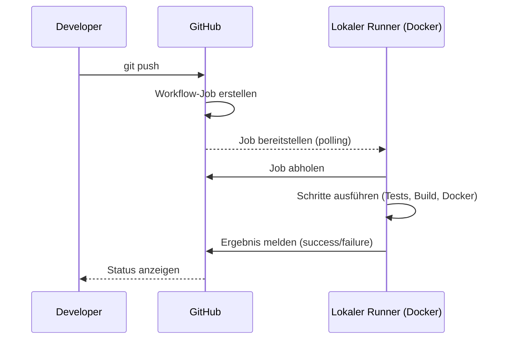
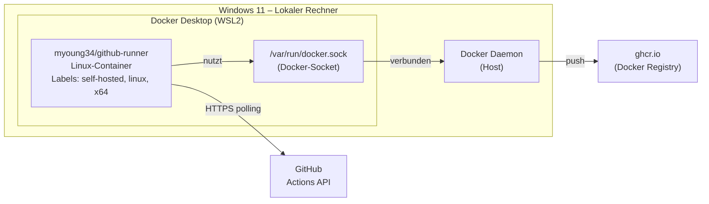

# Self-Hosted GitHub Actions Runner – Dokumentation

**Projekt:** Modul 324 DevOps – ToDo-Applikation  
**Datum:** 12.06.2026  
**Autoren:** Rudy, Martin

---

## 1. Was ist ein Self-Hosted Runner?

GitHub Actions bietet zwei Arten von Ausführungsumgebungen:

| Typ | Beschreibung | Kosten |
|---|---|---|
| **GitHub-hosted** | GitHub stellt eine VM (`ubuntu-latest` etc.) bereit | Kostenlos bis 2000 Min/Monat |
| **Self-hosted** | Eigener Rechner/Container führt die Jobs aus | Keine Zeitbeschränkung, volle Kontrolle |

Ein Self-Hosted Runner ist ein Prozess, der auf einem eigenen Rechner läuft, sich mit GitHub verbindet und auf eingehende Workflow-Jobs wartet. Sobald GitHub einen Job für diesen Runner scheduled, zieht der Runner die Aufgaben von GitHub und führt sie lokal aus.



---

## 2. Architektur: Runner in Docker

Der Runner läuft als Docker-Container auf dem lokalen Rechner. Er verbindet sich via HTTPS mit den GitHub-Servern – kein eingehender Port muss geöffnet werden.



**Docker-Socket-Mount:** Der Runner-Container bekommt Zugriff auf den Docker-Daemon des Host-Systems. So kann der CD-Workflow (`docker build`, `docker push`) direkt ausgeführt werden, ohne Docker im Docker zu installieren.

---

## 3. Einrichtung Schritt für Schritt

### Schritt 1: PAT erstellen (einmalig)

1. GitHub öffnen → Eigenes Profil → **Settings**
2. Links unten: **Developer settings**
3. **Personal access tokens** → **Tokens (classic)**
4. **Generate new token (classic)**
5. Name: `M324-Runner`, Expiration: nach Bedarf
6. Scope: **`repo`** (vollständig ankreuzen)
7. Token kopieren (nur einmal sichtbar!)

### Schritt 2: `.env`-Datei erstellen

```bash
# Im runner/-Verzeichnis
cd runner
cp .env.example .env
```

`.env` ausfüllen:
```env
REPO_URL=https://github.com/DerDexBot/Modul_324_DevOps
ACCESS_TOKEN=ghp_DEIN_TOKEN_HIER
RUNNER_NAME=local-docker-runner
RUNNER_LABELS=self-hosted,linux,x64
```

### Schritt 3: Runner starten

```bash
# Im runner/-Verzeichnis
docker compose up -d
```

Der Runner registriert sich automatisch bei GitHub und wartet auf Jobs.

### Schritt 4: Runner in GitHub prüfen

**GitHub → Repository → Settings → Actions → Runners**

Der Runner erscheint dort als **Idle** (bereit) wenn er läuft.

### Schritt 5: Runner stoppen / neu starten

```bash
# Stoppen
docker compose down

# Neustart
docker compose restart

# Logs ansehen
docker compose logs -f
```

---

## 4. Konfigurationsdateien

### `runner/docker-compose.yml`

```yaml
name: github-runner

services:
  runner:
    image: myoung34/github-runner:latest
    restart: unless-stopped
    environment:
      REPO_URL: ${REPO_URL}
      RUNNER_NAME: ${RUNNER_NAME:-local-docker-runner}
      ACCESS_TOKEN: ${ACCESS_TOKEN}
      RUNNER_WORKDIR: /tmp/github-runner-work
      LABELS: ${RUNNER_LABELS:-self-hosted,linux,x64}
      RUNNER_SCOPE: repo
    volumes:
      - /var/run/docker.sock:/var/run/docker.sock
      - runner_work:/tmp/github-runner-work
    security_opt:
      - no-new-privileges:true

volumes:
  runner_work:
    driver: local
```

**Wichtige Parameter:**

| Parameter | Wert | Erklärung |
|---|---|---|
| `image` | `myoung34/github-runner:latest` | Vorgefertigtes Runner-Image mit Auto-Registrierung |
| `restart: unless-stopped` | – | Container startet automatisch nach Reboot |
| `ACCESS_TOKEN` | PAT aus `.env` | Ermöglicht automatische Re-Registrierung bei Neustart |
| `RUNNER_SCOPE: repo` | – | Runner ist nur für dieses Repository registriert |
| `/var/run/docker.sock` | Socket-Mount | Zugriff auf Docker-Daemon des Hosts |
| `runner_work` | Docker Volume | Persistenter Arbeitsbereich für Job-Dateien |
| `no-new-privileges` | Security-Option | Container kann keine höheren Rechte erlangen |

---

## 5. Workflow-Konfiguration: `runs-on`

Alle drei Workflow-Dateien wurden auf den lokalen Runner umgestellt:

```yaml
# Vorher (GitHub-hosted)
runs-on: ubuntu-latest

# Nachher (Self-hosted)
runs-on: [self-hosted, linux, x64]
```

Die Labels `self-hosted`, `linux`, `x64` müssen mit den in `RUNNER_LABELS` definierten Labels übereinstimmen. GitHub wählt automatisch einen passenden Runner aus, wenn ein Job scheduled wird.

**Betroffene Dateien:**

| Workflow | Datei |
|---|---|
| CI Backend | `.github/workflows/ci.yml` |
| CI Frontend | `.github/workflows/ci-frontend.yml` |
| CD | `.github/workflows/cd.yml` |

---

## 6. Vergleich: GitHub-hosted vs. Self-hosted

| Kriterium | GitHub-hosted | Self-hosted (Docker) |
|---|---|---|
| **Setup** | Keine | Docker + PAT + `.env` |
| **Kosten** | 2000 Min/Monat kostenlos | Unbegrenzt (eigener Strom/Hardware) |
| **Geschwindigkeit** | Standard | Schneller bei grossen Caches (lokal) |
| **Kontrolle** | Keine | Vollständig |
| **Verfügbarkeit** | Immer | Nur wenn Container läuft |
| **Docker-Zugriff** | Begrenzt | Voll (Socket-Mount) |
| **Internet-Anforderung** | Nein (GitHub-Seite) | Ja (Runner muss GitHub erreichen) |

---

## 7. Sicherheitshinweise

- Die `.env`-Datei enthält den PAT und darf **niemals** committed werden (`.gitignore` in `runner/` vorhanden)
- Der PAT hat `repo`-Scope – Zugriff auf das gesamte Repository. Token regelmässig rotieren.
- Der Docker-Socket-Mount gibt dem Container theoretisch vollen Host-Zugriff. Nur für vertrauenswürdige Repos verwenden (kein Self-Hosted Runner für öffentliche Fork-PRs!).
- `no-new-privileges: true` verhindert Privilege-Escalation im Container.

---

## 8. Fehlerbehebung

| Problem | Mögliche Ursache | Lösung |
|---|---|---|
| Runner erscheint nicht in GitHub | Falscher `ACCESS_TOKEN` oder `REPO_URL` | `.env` prüfen, Token neu generieren |
| Jobs bleiben in "Queued" | Runner ist gestoppt | `docker compose up -d` im runner/-Ordner |
| Docker-Befehle schlagen fehl | Socket nicht gemountet | `docker compose down && docker compose up -d` |
| Runner deregistriert sich | PAT abgelaufen | Neuen PAT erstellen und `.env` aktualisieren |
| `Permission denied` auf Socket | Docker Desktop nicht gestartet | Docker Desktop starten |
