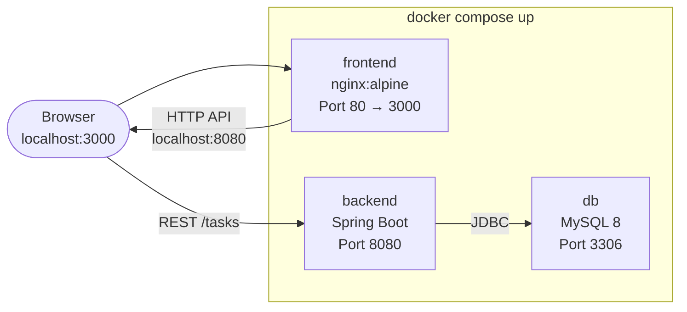
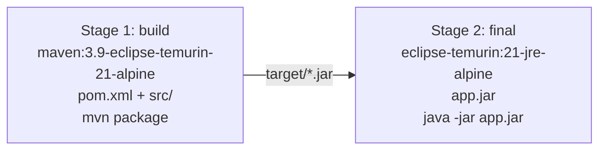
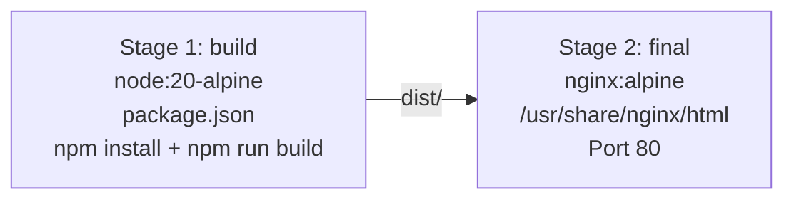
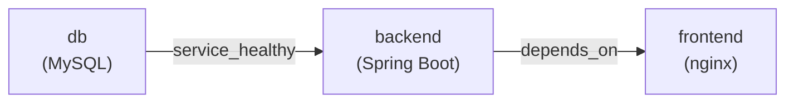
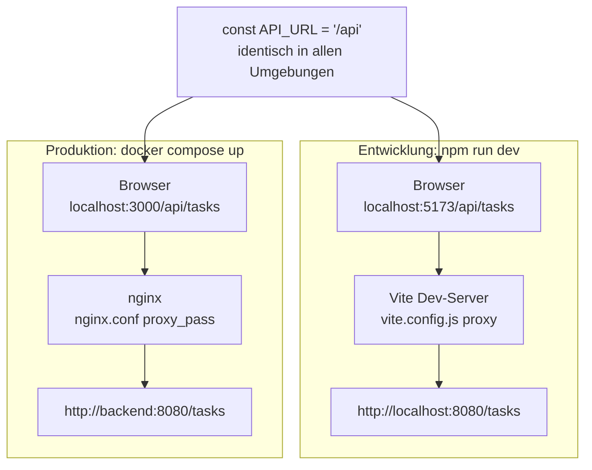

# Docker-Dokumentation – ToDo-App

**Projekt:** Modul 324 DevOps – ToDo-Applikation  
**Datum:** 19.06.2026  
**Autoren:** Rudy, Martin

---

## 1. Übersicht

Die ToDo-App besteht aus drei Komponenten, die als Docker-Container betrieben werden:



**Wichtig:** Das Frontend kommuniziert nicht direkt mit dem Backend im Docker-Netzwerk. Die React-App läuft im Browser des Nutzers und spricht das Backend über `localhost:8080` an (da Port 8080 auf dem Host exponiert wird).

---

## 2. Dockerfiles

### 2.1 Backend – Multi-Stage Build

**Datei:** `backend/Dockerfile`

```dockerfile
FROM maven:3.9-eclipse-temurin-21-alpine AS build
WORKDIR /app
COPY pom.xml .
RUN mvn dependency:go-offline -q
COPY src ./src
RUN mvn package -DskipTests -B -q

FROM eclipse-temurin:21-jre-alpine
WORKDIR /app
COPY --from=build /app/target/*.jar app.jar
EXPOSE 8080
ENTRYPOINT ["java", "-jar", "app.jar"]
```



**Warum zwei Stages?**
- Stage 1 enthält Maven, JDK, Source-Code → wird nach dem Build verworfen
- Stage 2 enthält nur JRE + JAR → kleines, sicheres Image (~180 MB statt ~500 MB)

### 2.2 Frontend – Multi-Stage Build

**Datei:** `frontend/Dockerfile`

```dockerfile
FROM node:20-alpine AS build
WORKDIR /app
COPY package*.json ./
RUN npm install
COPY . .
RUN npm run build

FROM nginx:alpine
COPY --from=build /app/dist /usr/share/nginx/html
EXPOSE 80
```



**Warum nginx?** Die React-App ist nach dem Build statisch (HTML/CSS/JS). nginx liefert diese Dateien performant aus und ist das Standardtool dafür.

---

## 3. Docker Compose (`docker-compose.yml`)

Die Datei liegt im **Root-Verzeichnis** des Projekts und orchestriert alle drei Services.

```yaml
services:
  db:
    image: mysql:8
    environment:
      MYSQL_DATABASE: tododb
      MYSQL_USER: todo
      MYSQL_PASSWORD: todo
      MYSQL_ROOT_PASSWORD: root
    ports:
      - "3306:3306"
    volumes:
      - db_data:/var/lib/mysql
    healthcheck:
      test: ["CMD", "mysqladmin", "ping", "-h", "localhost"]
      interval: 10s
      timeout: 5s
      retries: 5

  backend:
    image: ${DOCKERHUB_USERNAME}/todo-backend:latest
    ports:
      - "8080:8080"
    environment:
      SPRING_DATASOURCE_URL: jdbc:mysql://db:3306/tododb?createDatabaseIfNotExist=true&useSSL=false&allowPublicKeyRetrieval=true&serverTimezone=UTC
      SPRING_DATASOURCE_USERNAME: todo
      SPRING_DATASOURCE_PASSWORD: todo
    depends_on:
      db:
        condition: service_healthy

  frontend:
    image: ${DOCKERHUB_USERNAME}/todo-frontend:latest
    ports:
      - "3000:80"
    depends_on:
      - backend

volumes:
  db_data:
```

### Service-Erklärung

| Service | Image | Port | Beschreibung |
|---|---|---|---|
| `db` | `mysql:8` | 3306 | MySQL-Datenbank mit persistentem Volume |
| `backend` | `derdexbot/todo-backend:latest` | 8080 | Spring-Boot-API von Docker Hub |
| `frontend` | `derdexbot/todo-frontend:latest` | 3000→80 | React-App via nginx von Docker Hub |

### Startreihenfolge



`db` muss vollständig gestartet und gesund sein (`healthcheck`) bevor `backend` startet. `frontend` startet danach. Ohne diese Reihenfolge würde Spring Boot beim Start keinen Datenbankserver finden und abstürzen.

### Environment-Variablen (Spring Boot Override)

Spring Boot erlaubt das Überschreiben von `application.properties` via Umgebungsvariablen:

| Umgebungsvariable | Überschreibt | Wert |
|---|---|---|
| `SPRING_DATASOURCE_URL` | `spring.datasource.url` | `jdbc:mysql://db:3306/...` |
| `SPRING_DATASOURCE_USERNAME` | `spring.datasource.username` | `todo` |
| `SPRING_DATASOURCE_PASSWORD` | `spring.datasource.password` | `todo` |

`localhost` aus `application.properties` wird durch `db` ersetzt – dem Service-Namen im Docker-Netzwerk.

---

## 4. Lokales Testen

### Voraussetzungen

- Docker Desktop installiert und gestartet
- CD-Pipeline hat die Images auf Docker Hub gepusht (`derdexbot/todo-backend`, `derdexbot/todo-frontend`)

### Schritt 1: `.env`-Datei erstellen

Im Root-Verzeichnis des Projekts eine Datei `.env` erstellen:

```env
DOCKERHUB_USERNAME=derdexbot
DOCKERHUB_TOKEN=dckr_pat_...
```

Die `.env`-Datei ist in `.gitignore` eingetragen und wird nie committed.

### Schritt 2: App starten

```bash
# Im Root-Verzeichnis (wo docker-compose.yml liegt)
docker compose up
```

Docker zieht automatisch alle Images von Docker Hub falls nicht lokal vorhanden.

Warten bis im Terminal erscheint:
```
backend  | Started TodoApplication in X seconds
```

### Schritt 3: Im Browser testen

| URL | Beschreibung |
|---|---|
| `http://localhost:3000` | React-Frontend (ToDo-App) |
| `http://localhost:8080/tasks` | Backend-API direkt (JSON) |

### Schritt 4: App stoppen

```bash
# Stoppen (Ctrl+C) und Container entfernen
docker compose down

# Stoppen + Datenbank-Volume löschen (Daten zurücksetzen)
docker compose down -v
```

### Neueste Images holen

```bash
# Neue Images von Docker Hub laden
docker compose pull

# Dann neu starten
docker compose up
```

---

## 5. API-Proxy – Entwicklung vs. Produktion

### Das Problem mit hardcodierten URLs

Früher stand im Frontend:
```js
const API_URL = 'http://localhost:8080'
```

Das funktioniert nur lokal mit direktem Backend-Zugriff. In Docker, Kubernetes oder anderen Umgebungen ändert sich der Host – das Image müsste für jede Umgebung neu gebaut werden.

### Die Lösung: Relative URL + Proxy

Die App verwendet nun `/api` als Basis-URL:
```js
const API_URL = '/api'
```

Der Browser schickt `/api/tasks` immer an den Server von dem die Seite geladen wurde. Wer dann den Proxy macht hängt von der Umgebung ab – der Code bleibt identisch.



### nginx Reverse Proxy (`frontend/nginx.conf`)

In Produktion (Docker) übernimmt nginx den Proxy:

```nginx
location /api/ {
    proxy_pass http://backend:8080/;
}
```

`/api/` wird abgefangen und an den `backend`-Service weitergeleitet. Der `/api`-Prefix wird dabei weggeschnitten — das Backend kennt die Route als `/tasks`, nicht als `/api/tasks`.

`backend` ist der Service-Name aus `docker-compose.yml`. Im Docker-Netzwerk wird dieser Name automatisch zur internen IP aufgelöst.

### Vite Dev-Proxy (`frontend/vite.config.js`)

In der Entwicklung (`npm run dev`) übernimmt Vite den gleichen Job:

```js
server: {
  proxy: {
    '/api': {
      target: 'http://localhost:8080',
      rewrite: path => path.replace(/^\/api/, '')
    }
  }
}
```

| Eigenschaft | Wert | Erklärung |
|---|---|---|
| `'/api'` | Pfad-Prefix | Alle Anfragen die mit `/api` beginnen werden abgefangen |
| `target` | `http://localhost:8080` | Ziel: lokal laufendes Backend |
| `rewrite` | `/api` entfernen | `/api/tasks` → `/tasks` |

### Vergleich der beiden Umgebungen

| Aspekt | `npm run dev` | `docker compose up` |
|---|---|---|
| Frontend läuft auf | Port 5173 (Vite) | Port 3000 (nginx) |
| Proxy übernimmt | Vite Dev-Server | nginx |
| Backend-Adresse intern | `localhost:8080` | `backend:8080` (Docker-Netzwerk) |
| Code-Änderung nötig | Nein | Nein |

### Voraussetzung für `npm run dev`

Das Backend muss lokal erreichbar sein. Entweder:
```bash
# Nur DB und Backend via Docker starten
docker compose up db backend

# Dann Frontend lokal entwickeln
cd frontend && npm run dev
```

Oder das Backend direkt via Maven starten (erfordert lokale MySQL-Instanz).

---

## 6. Images auf Docker Hub

| Image | URL |
|---|---|
| Backend | `hub.docker.com/r/derdexbot/todo-backend` |
| Frontend | `hub.docker.com/r/derdexbot/todo-frontend` |

Jedes Image hat zwei Tags:
- `latest` – aktuellster Build auf `main`
- `sha-<commit>` – z.B. `sha-1f3e249` – eindeutig pro Commit, ermöglicht Rollback

---

## 6. Fehlerbehebung

| Problem | Ursache | Lösung |
|---|---|---|
| `backend` startet nicht | `db` noch nicht bereit | Warten – `healthcheck` regelt die Reihenfolge |
| `invalid reference format` | `DOCKERHUB_USERNAME` nicht gesetzt | `.env`-Datei prüfen |
| `Connection refused` beim API-Aufruf | Backend läuft noch nicht | Im Terminal auf `Started TodoApplication` warten |
| Alte Daten aus vorherigem Test | Volume noch vorhanden | `docker compose down -v` |
| Image nicht gefunden | CD-Pipeline noch nicht durchgelaufen | GitHub Actions → CD prüfen |
