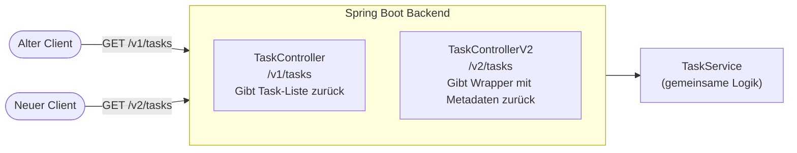
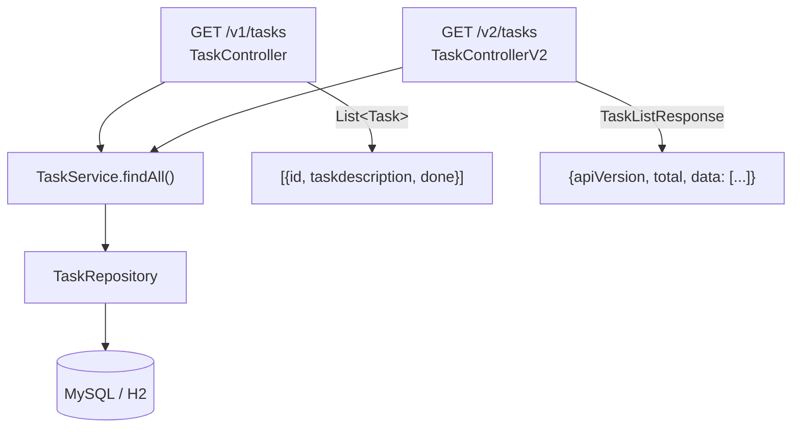

# API-Versionierung – ToDo-App

**Projekt:** Modul 324 DevOps – ToDo-Applikation  
**Datum:** 26.06.2026  
**Autoren:** Rudy, Martin

---

## 1. Einführung: Warum braucht eine REST-API Versionierung?

Eine REST-API wird selten einmalig entwickelt und dann nie mehr verändert. Im laufe der Zeit kommen neue Anforderungen hinzu, Antwortformate ändern sich oder Felder werden umbenannt. Das Problem: Bestehende Clients (z.B. mobile Apps, andere Systeme) wurden auf die alte API gebaut – sie brechen, wenn sich das Format ohne Vorwarnung ändert.

**Versionierung löst dieses Problem:** Alte und neue API-Versionen existieren parallel. Bestehende Clients nutzen weiter `/v1/tasks`, neue Clients können `/v2/tasks` mit erweitertem Antwortformat nutzen. Niemand muss gleichzeitig migrieren.



---

## 2. Übersicht: Methoden zur REST-API-Versionierung

Es gibt vier verbreitete Methoden, eine Spring-Boot-REST-API zu versionieren.

### 2.1 URL Path Versioning

Die Versionsnummer ist Teil des URL-Pfades:

```
GET /v1/tasks
GET /v2/tasks
```

**Implementierung in Spring Boot:**
```java
@RestController
@RequestMapping("/v1/tasks")
public class TaskController { ... }

@RestController
@RequestMapping("/v2/tasks")
public class TaskControllerV2 { ... }
```

### 2.2 Request Parameter Versioning

Die Version wird als Query-Parameter übergeben:

```
GET /tasks?version=1
GET /tasks?version=2
```

**Implementierung in Spring Boot:**
```java
@GetMapping(params = "version=1")
public List<Task> getAllTasksV1() { ... }

@GetMapping(params = "version=2")
public TaskListResponse getAllTasksV2() { ... }
```

### 2.3 Header Versioning (Custom Header)

Die Version steht in einem eigenen HTTP-Header:

```
GET /tasks
API-Version: 1

GET /tasks
API-Version: 2
```

**Implementierung in Spring Boot:**
```java
@GetMapping(headers = "API-Version=1")
public List<Task> getAllTasksV1() { ... }

@GetMapping(headers = "API-Version=2")
public TaskListResponse getAllTasksV2() { ... }
```

### 2.4 Media Type Versioning (Content Negotiation)

Die Version ist Teil des `Accept`-Headers (MIME-Type):

```
GET /tasks
Accept: application/vnd.todo.v1+json

GET /tasks
Accept: application/vnd.todo.v2+json
```

**Implementierung in Spring Boot:**
```java
@GetMapping(produces = "application/vnd.todo.v1+json")
public List<Task> getAllTasksV1() { ... }

@GetMapping(produces = "application/vnd.todo.v2+json")
public TaskListResponse getAllTasksV2() { ... }
```

---

## 3. Bewertung der Methoden

| Kriterium | URL Path | Request Param | Header | Media Type |
|---|---|---|---|---|
| **Lesbarkeit** | Sehr gut – Version sofort sichtbar | Gut – in URL erkennbar | Schlecht – Header versteckt | Schlecht – komplexer MIME-Type |
| **Testbarkeit** | Sehr einfach – Browser, curl, Postman | Einfach – Query-Parameter anhängen | Mittel – Header muss gesetzt werden | Schwer – Accept-Header selten manuell gesetzt |
| **Caching** | Sehr gut – unterschiedliche URLs sind cachebar | Gut – URL mit Param ist eindeutig | Schlecht – Header beeinflusst Cache-Key nicht immer | Schlecht – Content Negotiation stört Proxies |
| **REST-Konformität** | Mittel – Version in URL widerspricht reinem REST | Mittel | Gut – URL bleibt sauber | Sehr gut – entspricht HTTP-Standard am besten |
| **Einfachheit** | Sehr einfach | Einfach | Mittel | Komplex |
| **Verbreitung** | Sehr hoch (GitHub, Twitter, Stripe) | Mittel | Mittel | Niedrig |

### Detailbetrachtung

**URL Path Versioning** ist die in der Praxis am weitesten verbreitete Methode. Grosse APIs wie GitHub (`/v3/`), Stripe (`/v1/`) und Twitter nutzen sie. Die Version ist für jeden sofort sichtbar – auch im Browser-Tab oder in Server-Logs. Caching funktioniert problemlos, weil zwei Versionen zwei unterschiedliche URLs sind.

**Request Parameter Versioning** ist einfach umzusetzen, wirkt aber weniger professionell und wird in der Praxis selten eingesetzt. Parameter werden von manchen Proxy-Servern unterschiedlich behandelt.

**Header Versioning** hält die URL sauber, ist aber schwieriger zu testen: Man kann den Endpunkt nicht einfach im Browser aufrufen. Proxy-Server und CDNs ignorieren eigene Header manchmal beim Caching.

**Media Type Versioning** ist technisch die «reinste» Lösung und entspricht am besten dem HTTP-Standard. Sie ist aber kaum lesbar und in der Praxis ausserhalb grosser Konzerne (z.B. GitHub API v3 uses Accept-header variant) kaum anzutreffen.

---

## 4. Entscheidung: URL Path Versioning

Wir haben uns für **URL Path Versioning** entschieden.

### Begründung

- **Einfachheit:** Zwei Controller-Klassen, je mit eigenem `@RequestMapping`. Keine Konfiguration, keine Filter, kein Framework-Overhead.
- **Testbarkeit:** Jede Version ist direkt als URL aufrufbar – im Browser, mit curl, mit Postman, in JUnit-Tests mit MockMvc.
- **Klarheit:** Entwickler und Konsumenten sehen sofort, welche Version sie nutzen. Das ist besonders wichtig bei einem Schulprojekt mit wechselnden Reviewern.
- **Industriestandard:** GitHub, Stripe, PayPal und viele weitere APIs setzen auf diese Methode.
- **Caching:** Proxies und Browser können `/v1/tasks` und `/v2/tasks` getrennt cachen.

Der einzige Nachteil – die Version ist nicht «rein REST» weil sie eine technische Eigenschaft in der URL ausdrückt – ist für unser Schulprojekt vernachlässigbar.

---

## 5. Implementierung: Schritt-für-Schritt

### Schritt 1: Bestehenden Controller auf v1 umbenennen

**Datei:** `backend/src/main/java/com/example/demo/controller/TaskController.java`

```diff
- @RequestMapping("/tasks")
+ @RequestMapping("/v1/tasks")
  public class TaskController {
```

Damit sind alle bestehenden Endpunkte unter `/v1/tasks` erreichbar. Alte Clients können mit einem einfachen Pfad-Update migrieren.

### Schritt 2: DTO für v2-Response erstellen

**Datei:** `backend/src/main/java/com/example/demo/dto/TaskListResponse.java`

V2 gibt keine rohe Liste zurück, sondern ein Wrapper-Objekt mit Metadaten:

```java
public class TaskListResponse {
    private final String apiVersion = "2.0";
    private final int total;
    private final List<Task> data;

    public TaskListResponse(List<Task> data) {
        this.data = data;
        this.total = data.size();
    }
    // Getter ...
}
```

**Antwortformat V1:**
```json
[
  { "id": 1, "taskdescription": "Aufgabe 1", "done": false }
]
```

**Antwortformat V2:**
```json
{
  "apiVersion": "2.0",
  "total": 1,
  "data": [
    { "id": 1, "taskdescription": "Aufgabe 1", "done": false }
  ]
}
```

### Schritt 3: V2-Controller erstellen

**Datei:** `backend/src/main/java/com/example/demo/controller/TaskControllerV2.java`

```java
@RestController
@RequestMapping("/v2/tasks")
public class TaskControllerV2 {

    private final TaskService taskService;

    public TaskControllerV2(TaskService taskService) {
        this.taskService = taskService;
    }

    @GetMapping
    public TaskListResponse getAllTasks() {
        return new TaskListResponse(taskService.findAll());
    }

    // POST, PUT, DELETE identisch zu V1 – delegieren an denselben TaskService
}
```

**Wichtig:** Beide Controller nutzen denselben `TaskService`. Die Business-Logik ist nicht dupliziert – nur die Präsentationsschicht (Response-Format) unterscheidet sich.



### Schritt 4: Tests anpassen

**Backend-Tests** (`TaskControllerTest.java`): Alle Pfade von `/tasks` auf `/v1/tasks` aktualisiert.

**Neue V2-Tests** (`TaskControllerV2Test.java`): Testen das erweiterte Antwortformat.

```java
@Test
void getAllTasks_shouldReturnWrappedResponse() throws Exception {
    taskRepository.save(new Task("Erste Aufgabe"));

    mockMvc.perform(get("/v2/tasks"))
        .andExpect(jsonPath("$.apiVersion", is("2.0")))
        .andExpect(jsonPath("$.total", is(1)))
        .andExpect(jsonPath("$.data[0].taskdescription", is("Erste Aufgabe")));
}
```

### Schritt 5: Frontend auf v1 umstellen

**Datei:** `frontend/src/App.jsx`

```diff
- const API_URL = '/api'
+ const API_URL = '/api/v1'
```

Der Vite-Dev-Proxy und nginx leiten `/api/v1/tasks` korrekt an das Backend weiter – kein weiterer Konfigurationsaufwand nötig.

---

## 6. Endpunktübersicht nach Versionierung

| Methode | V1-Endpunkt | V2-Endpunkt | Unterschied |
|---|---|---|---|
| `GET` | `/v1/tasks` | `/v2/tasks` | V2 gibt `{apiVersion, total, data}` statt roher Liste |
| `POST` | `/v1/tasks` | `/v2/tasks` | Identisch |
| `PUT` | `/v1/tasks/{id}` | `/v2/tasks/{id}` | Identisch |
| `PUT` | `/v1/tasks/{id}/done` | `/v2/tasks/{id}/done` | Identisch |
| `DELETE` | `/v1/tasks/{id}` | `/v2/tasks/{id}` | Identisch |

---

## 7. Testanzahl nach der Erweiterung

| Schicht | Testklasse | Tests |
|---|---|---|
| Repository | `TaskRepositoryTest` | 9 |
| Service | `TaskServiceTest` | 10 |
| Controller V1 | `TaskControllerTest` | 11 |
| Controller V2 | `TaskControllerV2Test` | 5 |
| Kontext | `DemoApplicationTests` | 1 |
| **Total** | | **36** |

---

## 8. Zusammenfassung und Schlussfolgerungen

API-Versionierung ist eine wichtige DevOps-Praxis, um einen stabilen Betrieb zu gewährleisten wenn eine API weiterentwickelt wird. Für unser Projekt haben wir **URL Path Versioning** gewählt, weil es die klarste, am einfachsten testbare und in der Praxis am weitesten verbreitete Methode ist.

Die Implementierung zeigt das Kernprinzip: Beide Versionen teilen sich dieselbe Business-Logik (`TaskService`) – nur die Präsentationsschicht unterscheidet sich. V2 liefert ein erweitertes JSON-Format mit Metadaten (`apiVersion`, `total`), das neuen Clients mehr Informationen gibt, ohne alte Clients zu brechen.

**Erkenntnisse:**
- Versionierung erfordert bewusste Planung – sie nachträglich einzuführen bedeutet, alle bestehenden Clients zu informieren
- Früh mit Versionierung anfangen (auch wenn noch keine zweite Version existiert) vereinfacht spätere Erweiterungen
- Der Unterschied zwischen V1 und V2 muss klar und sinnvoll sein – reine Umbenennung bringt keinen Mehrwert
